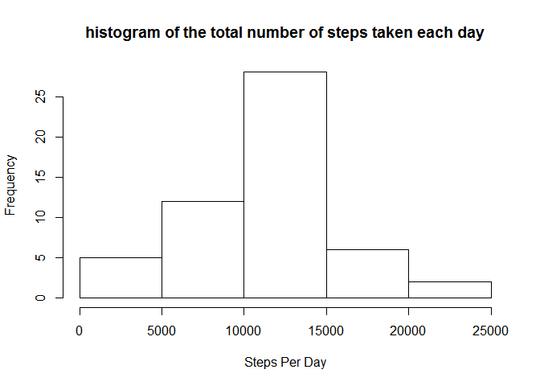
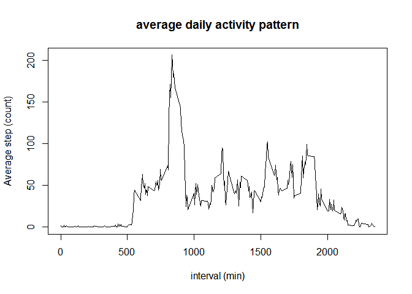
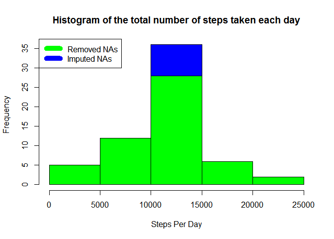
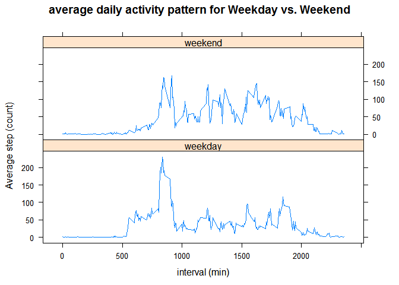

Loading and preprocessing the data
----------------------------------

    df <- read.csv("activity.csv")
    head(df)

    ##   steps       date interval
    ## 1    NA 2012-10-01        0
    ## 2    NA 2012-10-01        5
    ## 3    NA 2012-10-01       10
    ## 4    NA 2012-10-01       15
    ## 5    NA 2012-10-01       20
    ## 6    NA 2012-10-01       25

    str(df)

    ## 'data.frame':    17568 obs. of  3 variables:
    ##  $ steps   : int  NA NA NA NA NA NA NA NA NA NA ...
    ##  $ date    : Factor w/ 61 levels "2012-10-01","2012-10-02",..: 1 1 1 1 1 1 1 1 1 1 ...
    ##  $ interval: int  0 5 10 15 20 25 30 35 40 45 ...

The mean total number of steps taken per day:

    stepPerDay <- aggregate(steps~date, df, sum)
    hist(stepPerDay$steps, xlab = "Steps Per Day", main = "histogram of the total number of steps taken each day")

mean and median of the total number of steps taken per day:

    summary(stepPerDay$steps)

    ##    Min. 1st Qu.  Median    Mean 3rd Qu.    Max. 
    ##      41    8841   10760   10770   13290   21190

Average daily activity pattern
------------------------------

    stepsByInterval <- aggregate(steps~interval, df, mean, na.rm=TRUE)
    with(stepsByInterval, plot(interval, steps , type="l", xlab = "interval (min)", ylab = "Average step (count)", main = "average daily activity pattern"))

As per above graph, the maximum number of steps happens in 835 min.

Imputing missing values
-----------------------

The total number of missing values are:

    totalNa <- sum(is.na(df$steps))

1.  

In order to check the bias toward removing the missing rows, the daily
average value is imputed.

    dfFilled <- transform(df, steps = ifelse(is.na(df$steps), stepsByInterval$steps[match(df$interval, stepsByInterval$interval)], df$steps)) 
    head(dfFilled)

    ##       steps       date interval
    ## 1 1.7169811 2012-10-01        0
    ## 2 0.3396226 2012-10-01        5
    ## 3 0.1320755 2012-10-01       10
    ## 4 0.1509434 2012-10-01       15
    ## 5 0.0754717 2012-10-01       20
    ## 6 2.0943396 2012-10-01       25

To see the effect of missing vaue imputation, the total number of steps
taken each day is compare with the data when missing value are just
removed.

    stepsPerDayImputed <- aggregate(steps~date, dfFilled, sum)

    hist(stepsPerDayImputed$steps, col = "blue", xlab = "Steps Per Day", main = "Histogram of the total number of steps taken each day")
    hist(stepPerDay$steps, col = "green", add = TRUE, xlab = "Steps Per Day")
    legend("topleft", c("Removed NAs", "Imputed NAs"), col = c("green", "blue"), lwd = 10)

mean and median of the total number of steps taken per day for the
imputed data:

    summary(stepsPerDayImputed$steps)

    ##    Min. 1st Qu.  Median    Mean 3rd Qu.    Max. 
    ##      41    9819   10770   10770   12810   21190

differences in activity patterns between weekdays and weekends
--------------------------------------------------------------

Creating a new factor variable in the dataset with two levels -
"weekday" and "weekend" indicating whether a given date is a weekday or
weekend day:

    dfFilled$weekDay <- as.factor(ifelse(is.element(weekdays(as.Date(dfFilled$date)),c("Monday", "Tuesday", "Wednesday", "Thursday", "Friday")), "weekday", "weekend"))

    stepsByInterval <- aggregate(steps ~ interval + weekDay, dfFilled, mean)

    library(lattice)
    xyplot(stepsByInterval$steps ~ stepsByInterval$interval|stepsByInterval$weekDay,xlab = "interval (min)", ylab = "Average step (count)", main = "average daily activity pattern for Weekday vs. Weekend", layout=c(1,2), type="l")

